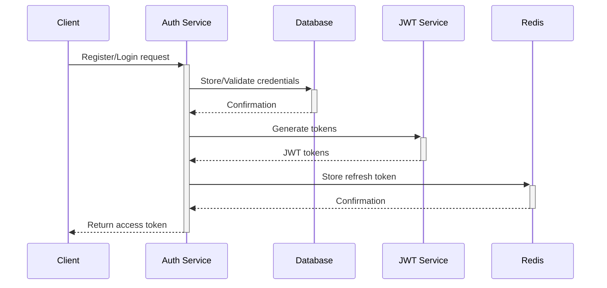
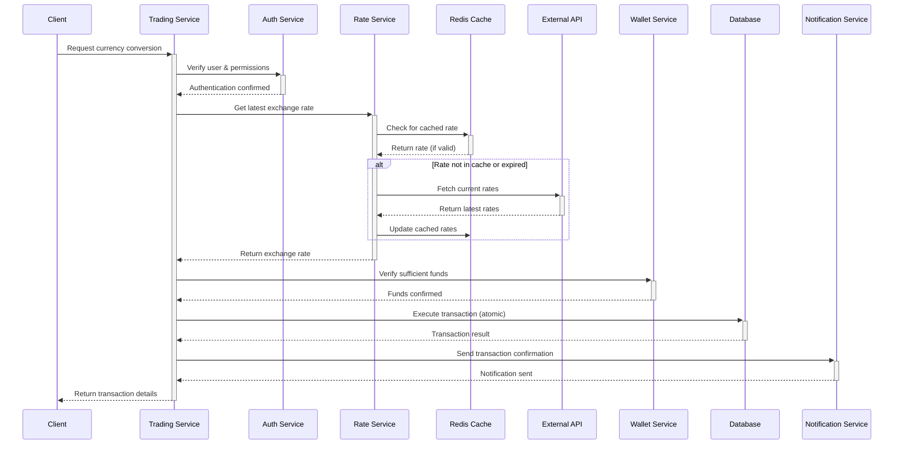

# FX Trading Application

## Technical Documentation

This document provides a comprehensive technical overview of the FX Trading platform built with NestJS, TypeORM, PostgreSQL, Redis, and Gmail SMTP.

## Table of Contents

- [Overview](#overview)
- [Key Features](#key-features)
- [Architecture](#architecture)
  - [System Architecture](#system-architecture)
  - [Module Structure](#module-structure)
  - [Data Flow](#data-flow)
- [Technical Stack](#technical-stack)
- [Key Architectural Decisions](#key-architectural-decisions)
- [Database Schema](#database-schema)
- [API Documentation](#api-documentation)
- [Security Measures](#security-measures)
- [Scalability Approach](#scalability-approach)
- [Infrastructure Requirements](#infrastructure-requirements)
- [Deployment Strategy](#deployment-strategy)
- [Monitoring and Logging](#monitoring-and-logging)
- [Development Guidelines](#development-guidelines)
- [Testing Strategy](#testing-strategy)

---

## Overview

The FX Trading Application is a high-performance, secure, and scalable system designed to serve millions of users. It allows users to register, verify their email, fund multiple currency wallets, and perform currency trades using real-time exchange rates.

### Key Assumptions

1. **User Base Scale**: System is designed to handle millions of users with varying activity levels
2. **Transaction Volume**: Peak of 1,000 transactions per second during high activity periods
3. **Data Storage**: Active user data needs low-latency access; historical data can be archived
7. **Uptime Requirements**: 99.99% availability target 
8. **Failure Recovery**: System must be resilient to component failures with no data loss
9. **Integration Points**: Third-party integrations include FX rate providers, payment processors, and email services

## Key Features

- User registration and email verification
- Multi-currency wallet management
- Real-time FX rates from external APIs
- Currency conversion with accurate rate application
- Comprehensive transaction history
- Secure authentication with JWT and refresh tokens
- Two-factor authentication for sensitive operations

---

## Architecture

### System Architecture

The application follows a microservices-inspired architecture within a modular monolith that can be easily split into true microservices as needed.


### Module Structure

```
src/
├── auth/                    # Authentication & User identity
├── users/                   # User management
├── wallets/                 # Wallet & balance management
├── trading/                 # Currency trading operations
├── rates/                   # FX rate fetching and caching
├── notifications/           # Email and alerts
├── common/                  # Shared utilities
├── config/                  # Application configuration
```

Each module is designed with clear boundaries and responsible for a specific domain within the application.

### Data Flow

#### Authentication Flow



#### Trading Flow




## Technical Stack

- **Backend Framework**: NestJS (latest)
- **ORM**: TypeORM (latest)
- **Database**: PostgreSQL 13+
- **Caching**: Redis 6+
- **Email Service**: Gmail SMTP
- **Authentication**: JWT with refresh tokens
- **API Documentation**: Swagger/OpenAPI 3.0
- **Testing**: Jest, SuperTest
- **Containerization**: Docker & Kubernetes


---

## Key Architectural Decisions

| Decision | Rationale | Alternatives Considered |
|----------|-----------|-------------------------|
| Modular Monolith with Domain Separation | Simplifies initial development while enabling future microservice transition | Pure microservices, traditional monolith |
| PostgreSQL as Primary Database | ACID compliance, JSON support, mature ecosystem | MongoDB, MySQL |
| Redis for Caching | High-performance, in-memory data store with TTL support | Memcached, Elasticsearch |
| JWT for Authentication | Stateless authentication with support for short token lifetimes | Session-based auth, OAuth only |
| Refresh Token Rotation | Enhanced security preventing token reuse | Fixed refresh tokens |
| Horizontal Scaling | Allows adding resources based on demand | Vertical scaling |
| Rate Limiting | Prevents abuse and ensures fair resource allocation | No rate limiting, IP-based only |
| Database Connection Pooling | Efficient connection management for high-throughput scenarios | Single connections, connection per request |
| Separation of Read/Write Operations | Optimizes database load and performance | Unified read/write access |
| Two-Phase Commits for Critical Transactions | Ensures data consistency in distributed operations | Single-phase commits, eventual consistency |

### Security-Specific Decisions

| Security Feature | Implementation | Benefit |
|------------------|----------------|---------|
| Password Hashing | bcrypt with high work factor | Protection against brute-force attacks |
| JWT Access Tokens | Short-lived (15 min) signed tokens | Limited exposure window |
| Refresh Tokens | HTTP-only cookies, rotation policy | Protection against XSS, token theft |
| Rate Limiting | Redis-backed rate limiting with IP and user-based policies | Prevent brute-force and DoS attacks |
| Input Validation | Class-validator with strict schema validation | Prevent injection and malformed input attacks |
| HTTPS | TLS 1.3 with strong cipher suites | Encrypted data transmission |
| Security Headers | CSP, HSTS, X-Frame-Options, etc. | Browser-based protection mechanisms |
| 2FA for Critical Operations | OTP via email | Extra verification layer |
| Token Blacklisting | Redis-backed immediate invalidation | Quick response to compromised tokens |

---

## Database Schema

### Core Entities


### Entity Relationships

- **User** ↔ **Wallet**: One-to-many (One user can have multiple wallets in different currencies)
- **Wallet** ↔ **Transaction**: One-to-many (One wallet can have multiple transactions)
- **User** ↔ **Transaction**: One-to-many (One user can initiate multiple transactions)
- **User** ↔ **OTP**: One-to-many (One user can request multiple OTPs for different actions)
- **FX Rate** ↔ **Transaction**: Many-to-many (Multiple rates can be used in multiple transactions)

---

## API Documentation

The application provides a comprehensive RESTful API with the following primary endpoints:

### Authentication

- `POST /auth/register` - User registration
- `POST /auth/verify` - User OTP verification
- `POST /auth/login` - User login
- `POST /auth/refresh-token` - Refresh access token
- `POST /auth/logout` - User logout
- `POST /auth/forgot-password` - Initiate password reset
- `POST /auth/reset-password` - Complete password reset

### Wallet Management

- `GET /wallets` - Get user wallets
- `POST /wallets` - Create a new wallet
- `GET /wallets/:id` - Get wallet details
### Trading

- `POST /wallets/fund` - Fund a wallet
- `POST /wallets/convert` - Convert currency
- `POST /wallets/trade` - Trade naira
- `GET /transactions` - Get wallet transactions
- `GET /fx/rates` - Get rates


Full API documentation is available via Swagger at `/api/docs` when the application is running.

---

## Security Measures

The application implements multiple layers of security:

1. **Authentication**
   - JWT-based authentication with short-lived tokens
   - Secure refresh token handling with rotation
   - Email verification
   - Password policies and secure storage

2. **Authorization**
   - Role-based access control
   - Resource-level permissions
   - Two-factor authentication for sensitive operations

3. **Data Protection**
   - All sensitive data encrypted at rest
   - TLS for data in transit
   - PII data handling compliance

4. **API Security**
   - Rate limiting
   - Input validation
   - CSRF protection
   - Security headers
   - CORS configuration

5. **Monitoring & Alerting**
   - Audit logging
   - Suspicious activity detection
   - Real-time security alerts

---

## Scalability Approach

The application is designed for horizontal scalability:

### Database Scalability

- Read replicas for heavy read operations
- Database sharding for user data partitioning
- Connection pooling for efficient resource utilization

### Application Scalability

- Stateless design enabling multiple instances
- Redis for distributed caching and session management

### Performance Optimizations

- Response caching for frequently accessed data
- Database query optimization and indexing
- Asynchronous processing for non-critical operations
- Pagination for large data sets


---

## Development Guidelines

### Code Style and Standards

- TypeScript strict mode
- ESLint configuration
- Prettier for code formatting
- NestJS best practices


### Environment Setup

```bash
# Clone repository
git clone https://github.com/dayo-adewuyi/fx-trading-app.git

# Install dependencies
npm install

# Set up environment variables
cp .env.example .env

# Start development environment
npm run start:dev
```

---

## Testing Strategy

### Unit Testing

- Service and utility functions
- Repository methods
- Guards and interceptors

### Integration Testing

- API endpoints
- Database interactions
- External service integrations

### E2E Testing

- Complete user journeys
- Performance testing
- Security testing

### Testing Tools

- Jest for unit and integration tests
- Supertest for HTTP testing
- k6 for load testing

## Monitoring and Logging

### Logging

- Structured JSON logging
- Log levels (ERROR, WARN, INFO, DEBUG)
- Request correlation IDs
- PII redaction in logs

### Metrics

- Request rate and latency
- Database query performance
- Cache hit/miss ratio
- External API response times
- Authentication success/failure rates

### Alerting

- Service availability
- Error rate thresholds
- Security incidents
- Database performance degradation
- Rate limit breaches

---

